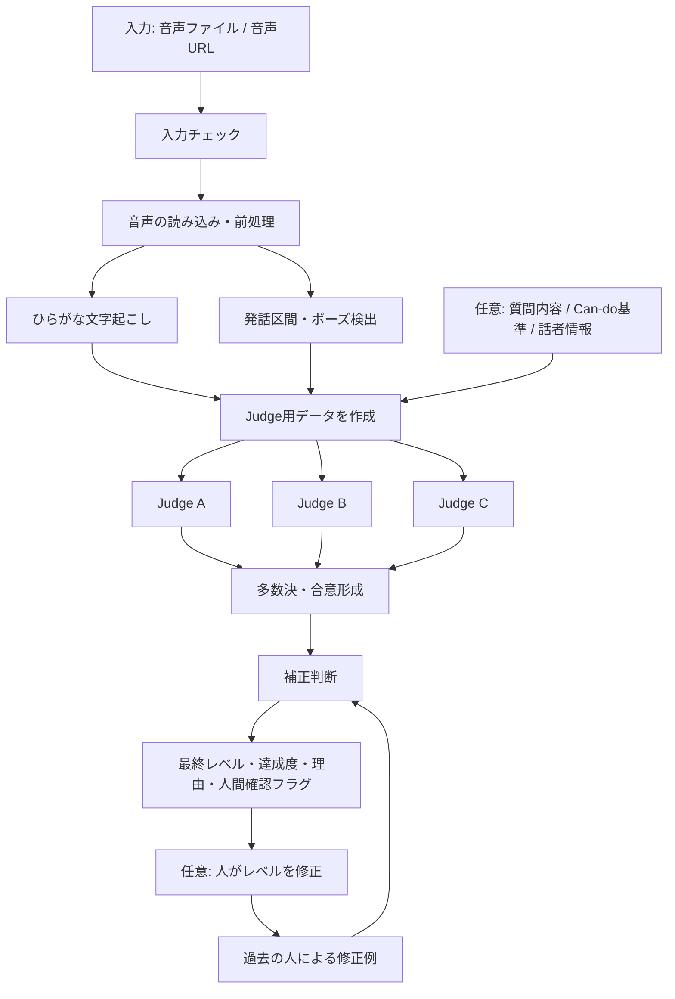

# J-GRADE 日本語発話評価 / STT 検証環境

外国人日本語学習者の音声を **ひらがなのみ・意味補正なし** でテキスト化し、
発話の内容と流暢さを複数のAIで確認して、CEFR/JFスタンダードのレベルを推定する検証環境です。

## 最初にここを読んでください

### このPRで何ができるか

現在のJ-GRADE評価エンジンは、**学習者が録音した1つの回答を受け取り、その日本語レベルを推定するところ**まで実装されています。

利用者から見ると、基本的な流れは次のとおりです。

1. 評価したい音声ファイルを選ぶ。
2. Systemが音声をひらがなに文字起こしする。
3. Systemが、話していた時間、話す速さ、ポーズなどを測る。
4. 1〜3つのAIが、文字起こしと測定値をそれぞれ評価する。
5. 複数AIの結果をまとめ、最終レベル、課題達成度、判定理由を表示する。
6. 必要に応じて人が正しいレベルへ修正し、その修正を次回以降の判定材料として保存する。

実装済みの主な機能は以下です。

| 機能 | 現在の状態 | 説明 |
| --- | --- | --- |
| 音声ファイルの読み込み | 実装済み | MP3、WAV、M4A、FLAC、OGGをローカルConsoleで選択できる。HTTP APIはMP3、WAV、M4Aに対応。 |
| ひらがな文字起こし | 実装済み | 日本語を漢字へ直したり、意味を補ったりせず、音声から聞き取れたひらがなを残す。 |
| 流暢さの測定 | 実装済み | 発話率、ポーズ数、最長ポーズ、1秒あたりのモーラ数などを計算する。 |
| 複数AIによる評価 | 実装済み | OpenAI、Anthropic、Gemini、xAI、Groq、またはローカル確認用mockから、1〜3つを選べる。 |
| 最終評価の集約 | 実装済み | 複数AIのレベルを多数決などのルールでまとめる。多数派がない場合は人間確認フラグを出す。 |
| 判定理由の表示 | 実装済み | 発話内容、流暢さ、上下レベルとの境界を理由として返す。 |
| API連携 | MVP実装済み | 音声ファイルまたは音声URLを受け取り、評価結果をJSONで返す。現在は1回のリクエスト内で完了する同期処理。 |
| 評価結果の人による修正 | 実装済み | AIのレベル判定を人が修正し、修正履歴を次回の評価材料へ反映できる。 |
| 正解付きデータとの比較 | 実装済み | AI判定と人間の正解を比較し、一致率、隣接レベル一致率、モデルの失敗数などを集計する。 |

### 現在まだ含まれていない機能

以下は、このPRの現在の評価エンジンには含まれていません。

- 学習者に最初の質問を自動で出す機能
- 学習者の回答内容に応じて、次の質問を生成する機能
- 複数回の質疑応答を1つの会話として管理する機能
- 会話全体をまとめて最終評価する専用フロー
- 学習者向けのWeb画面・スマートフォン画面
- 本番用のユーザー管理、ログイン、永続DB、課金管理

コマンド名にある `interactive` は、**運用者が評価に使うAIと音声ファイルを対話形式で選ぶConsole**という意味です。
学習者とAIが質疑応答する機能という意味ではありません。

9月に「質問 → 学習者の回答 → 内容に応じた追加質問 → 会話全体の評価」まで見せる場合は、
質問生成、会話セッション管理、ターンごとの録音、追加質問、会話全体の評価を追加開発する必要があります。
現在の音声処理・複数AI評価・補正機能は、その最終評価部分として再利用できます。

### A1、A2、B1、B2、C1、C2とは

このSystemが返すレベル名です。数値が大きいほど上位で、`A → B → C` の順に高くなります。

| レベル | このREADMEでの大まかな理解 |
| --- | --- |
| A1 | ごく基本的な単語や定型表現を使える。 |
| A2 | 身近な場面で、短く簡単なやり取りができる。 |
| B1 | 日常的な場面なら、自分で説明・質問し、用事を進められる。 |
| B2 | 幅広い話題で、理由や意見を比較的詳しく伝えられる。 |
| C1 | 複雑な話題でも、目的に合わせて柔軟かつ詳しく話せる。 |
| C2 | 非常に高度で、細かな意味の違いも含めて自然に運用できる。 |

これは理解のための簡略説明です。正式な判定では、JFスタンダードのCan-do、発話内容、
流暢さ、上下レベルとの境界を合わせて確認します。

## プロセッシングの流れ



### 1. 入力

入口は3種類あります。

| 入口 | 主な用途 | 入力 |
| --- | --- | --- |
| Console | 手元で1音声を試す | ファイル選択画面、パス入力、`audio/`内のサンプル |
| CLI/manifest | 複数音声をまとめて試す | 音声パス、質問内容、想定レベルなどを記載したJSON |
| HTTP API | 別Systemから呼び出す | 音声ファイルのアップロード、または`audio_url` |

質問内容、JF Can-do基準、母語などの話者情報は任意です。
指定しない場合でも音声だけでレベル推定を実行できますが、課題を達成できたかの判断材料は少なくなります。

### 2. 入力チェック

Systemは、音声形式、言語、Judge数などを確認します。
APIキーはリクエスト本文では受け取らず、ローカルの`.env`または実行環境の環境変数から読みます。
`.env`はgit管理の対象外です。

### 3. 音声から客観データを作る

`jgrade_eval/audio_pipeline.py`の`FluencyExtractor`が、音声を1回処理して次のデータを作ります。

- `raw_transcript_hiragana`: 意味補正をしていないひらがな文字起こし
- `speech_ratio_pct`: 音声全体のうち、実際に話していた割合
- `pause_count`: ポーズの回数
- `avg_pause_sec`: 平均ポーズ時間
- `max_pause_sec`: 最も長いポーズ
- `mora_per_sec`: 1秒あたりに話した日本語の音の単位
- `speech_segments`: 話していた区間
- `top_pauses`: 長いポーズの上位

文字起こしは、読みやすい日本語へ書き換えません。言い間違い、発音、止まり方を評価材料として残すためです。

### 4. AIへ渡す評価データを作る

Systemは、次の情報を1つにまとめ、選択したすべてのJudgeへ同じ条件で渡します。

- ひらがな文字起こし
- 発話率、速度、ポーズなどの流暢性指標
- 質問・ロールプレイの内容（指定されている場合）
- JF Can-do基準（指定されている場合）
- 必要最小限の話者情報（指定されている場合）
- `A1`〜`C2`から1つを選び、理由を決められたJSON形式で返す指示

### 5. 1〜3つのAIが独立して判定する

各Judgeは、他のJudgeの回答を見ずに、次の項目を返します。

- 推定レベル
- 課題達成度（`◎`、`○`、`△`、`×`）
- 判定への自信度
- 判定理由
- 発話内容・流暢さ・上下レベルとの境界に関する根拠
- 注意事項

現在の実装では、選択したJudgeを順番に呼び出します。一部のJudgeが失敗しても、
1つ以上成功していれば成功分だけで集約し、失敗内容と人間確認フラグを残します。
すべて失敗した場合は評価エラーにします。

### 6. 複数AIの結果をまとめる

- 3つのうち2つ以上が同じレベルなら、そのレベルを採用する。
- 3つがすべて異なる場合は中央のレベルを採用し、人間確認を必要にする。
- 2つだけ使用して意見が分かれた場合は、低い方を採用し、人間確認を必要にする。
- 1つだけ成功した場合は、その結果を採用するが、人間確認を必要にする。

最終結果には、まとめたレベルだけでなく、各Judgeの結果と不一致の有無も残します。

### 7. 過去の修正例を使って補正する

人が以前の判定を修正している場合、Systemは、発話率、話す速さ、最長ポーズ、
文字起こし量が似ている修正例を探します。十分に似た修正例がある場合は、
多数決結果を補正し、必ず人間確認を必要にします。

同じ音声IDだけを強制的に上書きする仕組みではありません。
修正履歴は、AIへの追加例と、最終協議の参考材料として使われます。

### 8. 結果を返す

主な出力は以下です。

| 出力 | 意味 |
| --- | --- |
| `final_cefr_level` | 最終的に推定したA1〜C2のレベル |
| `task_rating` | 質問・課題をどの程度達成できたか |
| `confidence` | 判定への自信度 |
| `summary` / `reasons` | なぜその判定になったか |
| `objective_data` | ひらがな文字起こしと流暢性指標 |
| `judge_results` | 各AIが個別に出した評価 |
| `judge_failures` | 接続や応答に失敗したAI |
| `needs_human_review` | 人による確認を推奨するか |

### 9. 人が結果を確認・修正する

Consoleの最後、またはStreamlitのチューニング画面で、人が正しいレベルを選べます。
AIの結果と異なる場合は、修正前レベル、修正後レベル、客観データを
`tuning_profiles/base.json`などへ保存し、次回以降の評価材料にします。

現在画面から直接修正できるのはCEFRレベルです。AIへの指示文や自由な採点ルールを
画面から直接編集する機能ではありません。変更履歴は直近10件まで保存され、過去状態へ戻せます。

## テストで確認していること

「テスト成功」と「J-GRADEの評価が正しい」は別です。

| テスト | 確認できること | 確認できないこと |
| --- | --- | --- |
| 自動テスト | データ読込、集約、API、補正などのプログラム処理が想定どおり動くか | AIのレベル判定が人間の正解と一致するか |
| APIキー接続確認 | 各AIサービスへ認証・接続できるか | そのAIの評価が正しいか |
| 実LLM評価 | 実際のAIが指定形式で評価を返し、最終結果まで処理できるか | 1件だけでは全体の評価精度は判断できない |
| 正解付きベンチマーク | 人間の正解とAI判定の一致率やズレ | データに含まれないレベル・話者への精度 |

PR内の`examples/jgrade_roleplay_input.json`は、実音声ではなく処理確認用のデータです。
「市役所で、引っ越し手続きに必要な書類と提出期限を質問する」という回答例と、
ひらがな文字起こし、流暢性指標、想定レベルB1が入っています。

2026年7月29日のローカル確認では、自動テスト49件がすべて成功しました。
また、このサンプルをOpenAI、Anthropic、Geminiで実評価したところ、
処理は3社とも完了しましたが、OpenAIとAnthropicはA2、GeminiはB1を返しました。
これは複数AIによる処理が動くことの確認であり、評価精度の保証ではありません。
今後は正解付きサンプルを増やして、一致率とズレの傾向を確認する必要があります。

## 使用モデル

| ラベル | モデルID | ライセンス |
|--------|---------|---------|
| モデルA（推奨） | sakasegawa/japanese-wav2vec2-large-hiragana-ctc | Apache-2.0 |
| モデルB | slplab/wav2vec2-xls-r-300m-japanese-hiragana | 記載なし |
| モデルC | vumichien/wav2vec2-large-xlsr-japanese-hiragana | Apache-2.0 |

---

## 環境構築手順

### 前提

- macOS（Apple Silicon 推奨）
- Git
- [uv](https://docs.astral.sh/uv/)
- インターネット接続（モデルの初回ダウンロードに必要）

### 1. リポジトリのクローン

```bash
git clone --recurse-submodules https://github.com/goyojima-hash/japanese-speech-analysis.git
cd japanese-speech-analysis
```

すでにクローン済みの場合は、submoduleを初期化してください。

```bash
git submodule update --init --recursive
```

### 2. Python環境の構築

```bash
uv python install 3.11
uv sync --frozen
```

`.python-version`と`uv.lock`に基づいて、プロジェクト内の`.venv/`へ環境が作成されます。

### 3. モデルA チェックポイントのダウンロード（約600MB）

```bash
uv run python - <<'PY'
from huggingface_hub import hf_hub_download

hf_hub_download(
    repo_id="sakasegawa/japanese-wav2vec2-large-hiragana-ctc",
    filename="best-medium-ep5-inference.pt",
    local_dir="hiragana-asr/models/checkpoints",
)
print("ダウンロード完了")
PY
```

### 4. 3モデルの読み込み確認

```bash
uv run python check_models.py
```

---

## フォルダ構成

```
japanese-speech-analysis/
├── audio/                          # 音声ファイル（MP3/WAV等）
│   ├── burmese_japanese_1min.mp3
│   ├── indonesian_japanese_1min.mp3
│   └── vietnamese_japanese_1min.mp3
├── hiragana-asr/                   # モデルA用submodule
│   ├── models/checkpoints/
│   │   └── best-medium-ep5-inference.pt  # チェックポイント（要ダウンロード）
│   └── src/asr/                    # モデルAの推論コード
├── .venv/                          # uvが作成するPython仮想環境
├── pyproject.toml                  # 直接依存関係
├── uv.lock                         # 解決済み依存関係
├── check_models.py                 # フェーズ1: モデル読み込み確認
├── phase2_single_test.py           # フェーズ2: 単体動作確認
├── phase3_batch.py                 # フェーズ3: 一括処理
├── jgrade_eval/                    # J-GRADEタスク達成度評価エンジン
├── examples/                       # 評価エンジンの検証用JSON
├── tests/                          # ローカル検証テスト
├── results.csv                     # フェーズ3の出力結果
└── report.md                       # 検証レポート
```

---

## 実行手順

### フェーズ1: モデル読み込み確認

```bash
uv run python check_models.py
```

3モデルすべて「✓ 読み込み成功」と表示されれば OK。

### フェーズ2: 単体動作確認（1ファイル）

```bash
uv run python phase2_single_test.py
```

デフォルトは `audio/vietnamese_japanese_1min.mp3` を対象に3モデルで実行。  
対象ファイルを変更する場合はスクリプト内の `AUDIO_FILE` を編集。

### フェーズ3: 一括処理（全ファイル）

```bash
uv run python phase3_batch.py
```

`audio/` フォルダ内の全音声ファイルを3モデルで処理し、`results.csv` に保存。

### J-GRADE評価エンジン: ローカル検証

STT/流暢さ分析の後段として、Raw Transcriptと流暢さ指標を受け取り、3つのLLM Judgeの評価結果を多数決で集約する評価エンジンを追加しています。
実LLM APIキーがなくても、fixture JSONでプロンプト生成・多数決・CEFR合否判定・人間教師ラベルとのズレ測定を検証できます。

#### テスト用コンソール入口

GitHubから試す人は、環境構築後に `run_jgrade_console.command` を起動してください。macOSではFinderでダブルクリックするとTerminalが開き、音声ファイル選択から結果表示まで同じコンソール画面で進みます。

Judge LLMの選択は `config/judge_llms.json` で管理します。協力者はコードを編集せず、この設定ファイルの `judge_mode` と `live_judges` だけを変更してください。APIキーは `.env.example` を `.env` にコピーして、使うプロバイダのキーだけを入れます。

```bash
# Terminalから起動する場合
./run_jgrade_console.command

# Codexや通常シェルからmacOS Terminalを開いて起動する場合
./open_jgrade_console_terminal.command

# 実LLM Judgeで試す場合（一時上書き。通常は config/judge_llms.json を編集）
JGRADE_JUDGE_MODE=live ./run_jgrade_console.command

# 実LLM Judgeのモデルを固定する場合
JGRADE_JUDGE_MODE=live \
JGRADE_JUDGE_PROVIDERS=anthropic:claude-sonnet-4-6,openai:gpt-5.4-mini,gemini:gemini-3.1-pro-preview \
./run_jgrade_console.command
```

起動直後に `=== Judge設定 ===` が表示されます。ここで `mock Judgeで試す`、`設定ファイルのJudge 1〜3を使う`、`Judge 1〜3をこの画面で選ぶ` から選択できます。実LLM Judge候補には `key=valid`、`key=unchecked`、`key=missing`、`key=invalid` のようにAPIキー状態が表示されます。`valid` はプロバイダAPIで認証確認済み、`unchecked` はキーはあるがネットワーク等で確認未完了、`missing` は未設定、`invalid` は形式または認証に失敗した状態です。APIキーの値そのものは表示しません。

Judge設定の後に、ファイル選択ダイアログ、パス入力、または `audio/` 内のサンプル音声から音声を選べます。出口はコンソール末尾の `=== 最終結果 ===` です。ここに `CEFRレベル`、`タスク達成度`、`信頼度`、`人間確認`、判定理由、協議理由、ひらがなTranscript量、流暢性指標、3 Judge要約、補正材料が表示されます。

最終結果の後に `=== ユーザーレベル確認 ===` が表示されます。協力者はこのファイルの正しいCEFRレベルを選ぶか、`スキップ` できます。ユーザー選択レベルがSystemJudgeの判定と異なる場合は、`tuning_profiles/base.json` などのチューニングプロファイルに `tuning_examples` と補正統計を自動保存し、修正内容をコンソールに表示します。同じ音声IDを強制上書きするのではなく、次回以降は保存されたTranscript・流暢性指標・補正遷移を協議時の判断材料として使います。

協力者に送る詳しい手順と報告テンプレートは `docs/collaborator_testing.md` にあります。

```bash
# Judge A（Claude想定）に渡すプロンプトを生成
uv run python -m jgrade_eval prompt \
  --input examples/jgrade_roleplay_input.json \
  --judge A \
  --model-family claude

# 3 Judge x 3ロールプレイの多数決とCEFR合否判定
uv run python -m jgrade_eval consensus \
  --input examples/jgrade_judge_results.json \
  --output outputs/jgrade_decision.json

# 人間教師ラベルとAI判定のズレを集計
uv run python -m jgrade_eval benchmark \
  --input examples/jgrade_benchmark.json \
  --output outputs/jgrade_benchmark_report.json

# 音声を取り込み、客観データだけを確認
uv run python -m jgrade_eval extract-objective \
  --manifest examples/jgrade_audio_manifest.json \
  --base-dir . \
  --output outputs/jgrade_objective_data.json

# 客観データ抽出からJFS判定ロジックまで疎通確認
uv run python -m jgrade_eval evaluate-audio \
  --manifest examples/jgrade_audio_manifest.json \
  --base-dir . \
  --judge-mode mock \
  --output outputs/jgrade_audio_report.json

# 実LLM Judgeを1〜3つ選んで評価（APIキーは.envまたは環境変数から読む）
uv run python -m jgrade_eval evaluate-audio \
  --manifest examples/jgrade_audio_manifest.json \
  --base-dir . \
  --judge-mode live \
  --judge-providers anthropic:claude-sonnet-4-6,openai:gpt-5.4-mini,gemini:gemini-3.1-pro-preview \
  --output outputs/jgrade_live_report.json

# 対話式: 音声を選ぶ -> 客観データ表示 -> 1〜3 Judge CEFR推定 -> CEFR協議表示
# 音声はファイル選択ダイアログ、パス入力、またはサンプル音声から選べます
uv run python -m jgrade_eval interactive --judge-mode mock

# 対話式で実LLMを使う前に、ローカル.envへキーを設定
uv run python -m jgrade_eval configure-keys

# 対話式: Judge 1/2/3のLLMを番号で選ぶ -> 音声を選ぶ -> CEFR自動推定
uv run python -m jgrade_eval interactive --judge-mode live

# 実LLMをCLI引数で固定して評価
uv run python -m jgrade_eval interactive \
  --judge-mode live \
  --judge-providers anthropic:claude-sonnet-4-6,openai:gpt-5.4-mini,gemini:gemini-3.1-pro-preview

# 公式JFスタンダード・ロールプレイ音声をローカルに取得
# 音声は audio/ に集約し、公式JF音声だけgitには入れません
# 評価PDFと取得manifestは data/external/ に保存します
uv run python -m jgrade_eval download-jfs-samples \
  --output data/external/jfs_roleplay/download_manifest.json

# 取得した公式音声をチューニング/ベンチマーク用データセットへ変換
uv run python -m jgrade_eval prepare-jfs-dataset \
  --output data/tuning/jfs_roleplay_dataset.json

# 公式データセットでCEFR推定を検証
uv run python -m jgrade_eval.tuning_runner \
  --dataset data/tuning/jfs_roleplay_dataset.json \
  --profile tuning_profiles/base.json \
  --out outputs/jfs_roleplay_tuning_report.json

# HTTP APIを起動（mock JudgeならAPIキーなしで動作）
.venv/bin/python -m uvicorn jgrade_eval.api:app --host 127.0.0.1 --port 8000

# 別ターミナルから音声をアップロードして判定
curl -s -X POST http://127.0.0.1:8000/api/v1/speech-level-evaluations \
  -F "audio=@audio/vietnamese_japanese_1min.mp3" \
  -F "external_id=local-api-smoke" \
  -F "language=ja" \
  -F "judge_mode=mock" \
  -F "roleplay_task=社会的な話題について、自分の考えと理由を述べる。" \
  | python -m json.tool

# テスト
uv run python -m unittest discover -s tests
```

対話式CLIではCEFRレベルやロールプレイ課題を人間が入力せず、客観データをもとに1〜3つのLLM Judgeが `A1`〜`C2` を推定し、多数決で最終CEFR推定を表示します。標準構成は3 Judgeですが、ローカル検証ではJudge 2/3をスキップできます。プロバイダは重複できません。
対話式CLIでは一部のJudge APIが失敗しても、少なくとも1つのJudgeが成功していれば、その成功分だけでCEFR集約を続行し、失敗したJudgeは警告として表示します。

HTTP APIは `POST /api/v1/speech-level-evaluations` で音声ファイルまたは `audio_url` を受け取り、`final_cefr_level`、`summary`、`reasons`、`objective_data`、`judge_results`、`needs_human_review` を返します。現在のローカルAPIは1リクエスト内で処理を完了して返すMVPです。将来の外部System統合では、同じレスポンス形を保ったまま非同期ジョブ化する想定です。

`objective_data` には、Fluency のひらがな文字起こし・タイミング指標に加え、非LLMの語彙Range根拠 `range_data` が入ります。Range は SudachiPy の固定分割モードAと同梱JLPT語彙スナップショットを使って、トークン、TTR、JLPT分布、未知語、同音異義語候補を記録します。JLPT分布だけで最終CEFRを決定するものではありません。辞書の出典と上書き仕様は [`docs/range-module-design.md`](docs/range-module-design.md) を参照してください。

自分で用意した複数音声をmanifestで試す場合は、`examples/jgrade_audio_manifest.json` と同じ形式で、候補者・試験レベル・ロールプレイごとの `audio_path`、タスク、JFS can-do基準、期待される情報を指定できます。`extract-objective` はこのリポジトリの `fluency.py` を使い、ひらがな文字起こし、発話率、ポーズ、モーラ速度、発話区間を出力します。`judge-mode mock` はAPIキーなしの疎通確認用で、正式なJFS判定ではありません。

テスト用音声は `audio/` に集約して管理します。公式JFスタンダードのロールプレイ音声は、`examples/jfs_roleplay_catalog.json` に出典URL・レベル・達成度・評価PDFをまとめています。対象はA2/B1/B2/C1の13サンプルです。JFロールプレイテストにはC2ロールプレイがないため、C2判定はこの公式音声だけでは検証できません。サイトポリシー上、公式音声/PDF本体はローカル利用にとどめ、公式音声は `.gitignore` で追跡しないでください。

実LLMで評価する場合は `configure-keys` を使うか、`.env.example` を `.env` にコピーして、使うプロバイダのキーだけを入れてください。`configure-keys` は各入力後と最後に `set/missing` だけを表示し、キー値は表示しません。対応するテキストJudgeプロバイダは `anthropic`, `openai`, `gemini`, `xai`, `groq` です。`interactive --judge-mode live` で `--judge-providers` を省略すると、Judge 1/2/3のLLMを番号で選べます。Judge 1で選んだプロバイダは2/3候補から消え、Judge 2/3ではスキップできます。`elevenlabs` はキーの保存状態だけ表示しますが、現時点ではテキストJudgeとしては使わず、将来の音声機能用に予約しています。

`uv` がPATHにないローカル環境では、既存の仮想環境があれば `.venv/bin/python -m jgrade_eval ...` または `.venv/bin/python -m unittest discover -s tests` で同じ検証を実行できます。

詳しい設計とAWS/API化の接続方針は `docs/jgrade_eval.md` を参照してください。

### J-GRADEチューニング画面

CLIや一括評価で判定した音声は、レビュー用データセット `data/tuning/review_samples.json` に蓄積できます。教師は画面上でCEFRだけを修正し、その修正から補正統計とFew-shot例がプロファイルへ保存されます。

```bash
# 教師ラベルCSVからチューニング用manifestを作成
.venv/bin/python tools/prepare_tuning_dataset.py \
  --labels examples/tuning_labels.csv \
  --audio-dir . \
  --out data/tuning/example_manifest.json

# 画面なしで一括評価を実行
.venv/bin/python -m jgrade_eval.tuning_runner \
  --dataset data/tuning/example_manifest.json \
  --profile tuning_profiles/base.json \
  --base-dir . \
  --out outputs/tuning_runs/example_mock.json

# チューニング画面を起動（判定履歴の蓄積ストアを開く）
.venv/bin/streamlit run tools/tuning_app.py -- \
  --dataset data/tuning/review_samples.json \
  --profile tuning_profiles/base.json \
  --output outputs/tuning_runs/example_mock.json \
  --base-dir .
```

`interactive` CLIで判定した音声は、標準では `data/tuning/review_samples.json` に自動保存されます。別の保存先にしたい場合は `--review-store` を指定してください。

`tools/tuning_app.py` には `Review Samples`, `CEFR Tuning`, `Metrics`, `Export` の4タブがあります。チューニングとして変更できる入力は `Corrected CEFR` だけです。プロンプト本文や任意メモは画面から直接編集せず、CEFR修正履歴をもとに内部で自動更新します。`Run benchmark` を押すと、レビュー用データセットの客観データと保存中のプロファイル設定でJudge評価を一括実行し、結果を同じレビュー用データセットへ戻します。

`CEFR Tuning` で教師が正しいCEFRへ修正し、`Apply CEFR correction` を押すと、AI推定から教師修正への `level_correction_stats` と、次回以降のLLMプロンプトおよび協議レイヤーに入る `tuning_examples` がプロファイルへ保存されます。これにより、同じサンプルIDを丸暗記して上書きするのではなく、類似するTranscript量・流暢性指標・補正遷移がJudge協議の判断材料になります。

補正適用・rollbackのたびに `changed_at` と `summary` 付きの履歴を残します。履歴は直近10件まで保持し、`Export` タブの `Recent profile changes` から任意の履歴へ戻せます。

教師ラベルCSVは以下の列を想定します。

```csv
sample_id,audio_path,human_cefr,human_rating,notes
a2_001,/Users/naoki/Desktop/A2_001.mp3,A2,○,
b1_001,/Users/naoki/Desktop/B1_001.mp3,B1,○,
```

#### 音声ファイルの命名規則

ファイル名に話者属性を含めること（自動判定される）：

| 含める文字列 | 判定される話者属性 |
|------------|----------------|
| `burmese` または `myanmar` | burmese |
| `indonesian` または `indonesia` | indonesian |
| `vietnamese` または `vietnam` | vietnamese |

---

## 音声ファイルの前処理

スクリプトは音声ファイルを自動で以下の形式に変換して処理します：

- サンプリングレート: **16kHz**（モデルの要求仕様）
- チャンネル: **モノラル**
- 対応形式: MP3, WAV, M4A, FLAC, OGG

変換は `librosa` が担当するため、別途変換ツールは不要。

---

## 出力 CSV の列説明

| 列名 | 内容 |
|------|------|
| ファイル名 | 処理した音声ファイル名 |
| 話者属性 | ファイル名から自動判定（burmese / indonesian / vietnamese） |
| モデル名 | HuggingFace モデルID |
| モデルラベル | モデルA / B / C |
| 出力テキスト | 文字起こし結果 |
| 漢字混入フラグ | True / False |
| カタカナ混入フラグ | True / False（「ー」長音符は除外） |
| 処理時間_秒 | 推論にかかった秒数 |
| 音声長_秒 | 音声ファイルの長さ（秒） |

---

## トラブルシューティング

### `torchaudio.load` でエラーが出る

torchaudio 2.11以降はFFmpegが必要です。このプロジェクトでは `librosa` で代替しているため問題ありません。

### モデルAのロードで `UNEXPECTED` キーの警告が出る

```
project_hid.bias | UNEXPECTED
```

推論には影響しません。無視して問題ありません。

### メモリ不足・速度低下

3モデル同時ロードでApple Silicon GPUのメモリ競合が発生する場合があります。  
1モデルずつ実行することで処理速度が大幅に改善します（フェーズ2参照）。

---

## 検証結果サマリー

→ 詳細は [report.md](report.md) を参照

| モデル | 漢字混入 | カタカナ混入 | 処理速度（60秒/単独） | 推奨度 |
|--------|---------|------------|-------------------|------|
| **A (sakasegawa)** | 0% | 0% | **約10秒** | **★★★ 推奨** |
| B (slplab) | 0% | 0% | 約34秒 | ★★ 参考 |
| C (vumichien) | 0% | 0% | 約302秒 | ★ 実用困難 |
