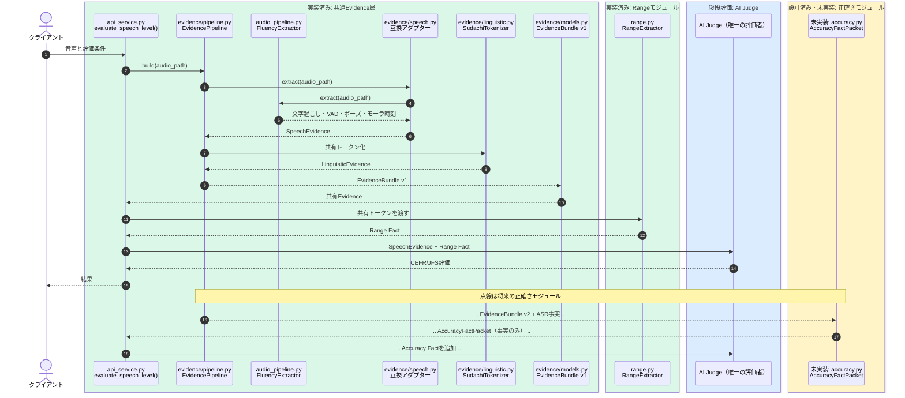

# 現在の構成図 — 共通Evidence層と正確さモジュール

上部にファイル／機能の四角を並べ、矢印を左右に追うUMLシーケンス図です。

```mermaid
sequenceDiagram
    autonumber
    actor Client as クライアント
    box rgb(218, 247, 232) 実装済み: 共通Evidence層
    participant API as api_service.py<br/>evaluate_speech_level()
    participant Pipeline as evidence/pipeline.py<br/>EvidencePipeline
    participant Speech as audio_pipeline.py<br/>FluencyExtractor
    participant Adapter as evidence/speech.py<br/>互換アダプター
    participant Linguistic as evidence/linguistic.py<br/>SudachiTokenizer
    participant Bundle as evidence/models.py<br/>EvidenceBundle v1
    end
    box rgb(218, 247, 232) 実装済み: Rangeモジュール
    participant Range as range.py<br/>RangeExtractor
    end
    box rgb(220, 236, 255) 後段評価: AI Judge
    participant Judge as AI Judge（唯一の評価者）
    end
    box rgb(255, 244, 199) 設計済み・未実装: 正確さモジュール
    participant Accuracy as 未実装: accuracy.py<br/>AccuracyFactPacket
    end

    Client->>API: 音声と評価条件
    API->>Pipeline: build(audio_path)
    Pipeline->>Adapter: extract(audio_path)
    Adapter->>Speech: extract(audio_path)
    Speech-->>Adapter: 文字起こし・VAD・ポーズ・モーラ時刻
    Adapter-->>Pipeline: SpeechEvidence
    Pipeline->>Linguistic: 共有トークン化
    Linguistic-->>Pipeline: LinguisticEvidence
    Pipeline-->>Bundle: EvidenceBundle v1
    Bundle-->>API: 共有Evidence
    API->>Range: 共有トークンを渡す
    Range-->>API: Range Fact
    API->>Judge: SpeechEvidence + Range Fact
    Judge-->>API: CEFR/JFS評価
    API-->>Client: 結果

    Note over Pipeline,Accuracy: 点線は将来の正確さモジュール
    Pipeline-->>Accuracy: .. EvidenceBundle v2 + ASR事実 ..
    Accuracy-->>API: .. AccuracyFactPacket（事実のみ） ..
    API->>Judge: .. Accuracy Factを追加 ..
```

- 実線は実装済みです。
- `Accuracy` への点線は設計済みで、まだコードはありません。
- AI JudgeだけがCEFR/JFSの評価を行います。
