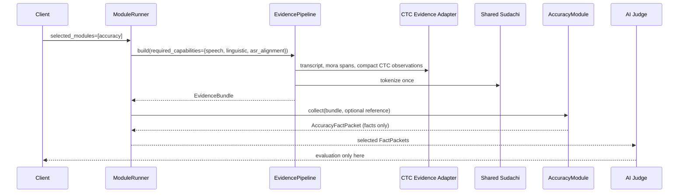

# Accuracy Module Design

## Decision

Implement Accuracy as an independent fact collector, not as a classifier. It consumes common evidence and returns `AccuracyFactPacket`. The shared layer gains optional ASR alignment capability data, while linguistic observations reuse the existing `LinguisticEvidence` without retokenizing.

## Why confidence is not accuracy

Wav2Vec2 CTC logits represent model token probabilities. Their selected-token posterior can be a useful observation about recognition uncertainty, but it is neither calibrated learner-performance probability nor evidence that the learner made a pronunciation/grammar error. Every posterior-derived value therefore includes `calibration_status="uncalibrated"`, a derivation label, model id, and decoding configuration.

## Implemented v1 and future provider boundary

The implemented v1 derives `AsrObservation` directly from the stable v1 mora timings, so it does not change `EvidenceBundle`, Fluency facts, or Range facts. Posterior fields are null and capability status is `unavailable`.

When a compact, validated CTC posterior provider is selected, the following additive Evidence v2 extension remains the intended path:

```text
EvidenceBundle (v2, additive)
├── source
├── speech
├── linguistic
└── asr_alignment: AsrAlignmentEvidence | None
    ├── decoder_provenance
    ├── units: AsrUnitEvidence[]
    │   ├── unit, start, end
    │   ├── selected_posterior_mean
    │   ├── competing_margin_mean
    │   ├── derivation = "ctc_frame_softmax"
    │   └── calibration_status = "uncalibrated"
    └── unavailable_reason: str | None

AccuracyFactPacket (module output)
├── module_id = "accuracy"
├── input_provenance
├── asr_observations
├── morphology_observations
├── reference_differences (only with explicit reference)
└── unavailable_capabilities
```

No frame logits will be serialized. A future ASR adapter must reduce the already-produced CTC logits to compact per-emission summaries before the bundle is created. This avoids large cache entries and preserves a stable, auditable derivation.

## Deterministic collectors

### ASR observation collector

1. CTC decoder emits the raw transcript and collapsed mora/character spans.
2. For frames belonging to an emitted unit, compute selected-label softmax posterior mean and selected-vs-next-best margin mean.
3. Emit the span and summaries with provenance; if logits/alignment are unavailable, emit `asr_alignment: unavailable`.

### Morphology observation collector

Use shared Sudachi tokens exactly once. Emit token facts and local pattern ids such as `particle_after_noun`, `auxiliary_after_verb`, and `inflection:<POS>:<form>`. Pattern ids describe what was observed; they do not label it valid or invalid and do not propose a correction.

### Optional reference-difference collector

Only when an explicit reference transcript is supplied, normalize using a named profile and align token sequences using deterministic edit distance. Record `equal`, `insert`, `delete`, and `replace` operations with source/target spans. A difference can be a legitimate paraphrase, so the module does not call it an error.

## Module selection and data flow



`ModuleRunner` selects capabilities before preprocessing. Thus Range-only requests do not require CTC posterior extraction, and Accuracy-only requests do not invoke Range or Fluency fact-module interpretation. The existing transcript/VAD extraction remains shared when needed.

## Provider boundary

Define an `AsrAlignmentProvider` protocol. The first provider wraps the current Wav2Vec2 CTC path. A future forced-alignment provider may implement the same capability for an explicitly supplied reference transcript, but cannot silently replace learner-ASR alignment or change packet meaning.

## Deferred decisions

- Exact Wav2Vec2 confidence calibration needs held-out Japanese learner-speech validation data.
- Phone-level pronunciation analysis needs a selected Japanese acoustic model, lexicon/G2P policy, and teacher-validated test corpus.
- Rule inventory/versioning needs teacher review before any local pattern is interpreted by the Judge prompt.
