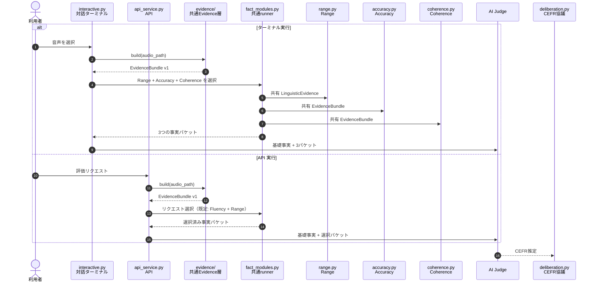

# Current Fact-Module Sequence

Both entry points use `fact_modules.py` after building common evidence. The interactive console deliberately selects every implemented module and prints every resulting packet. The API retains its historical default selection for response compatibility, but uses the identical runner and packet contract.

