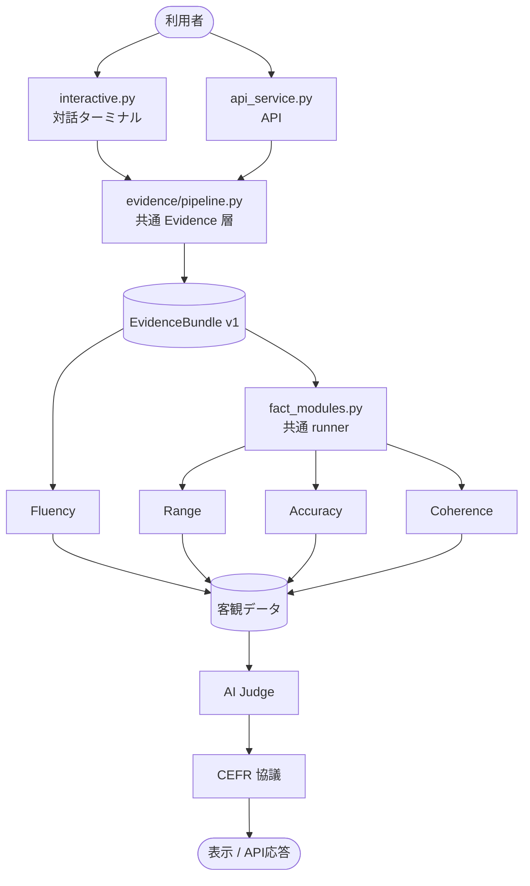

# Current Fact-Module Flow

This compact view is the current implementation. Common evidence is created once, every implemented module outputs only facts, and only the Judge/deliberation layer evaluates. Both the terminal and API call the same module runner after common evidence and, by default, select all implemented modules.

