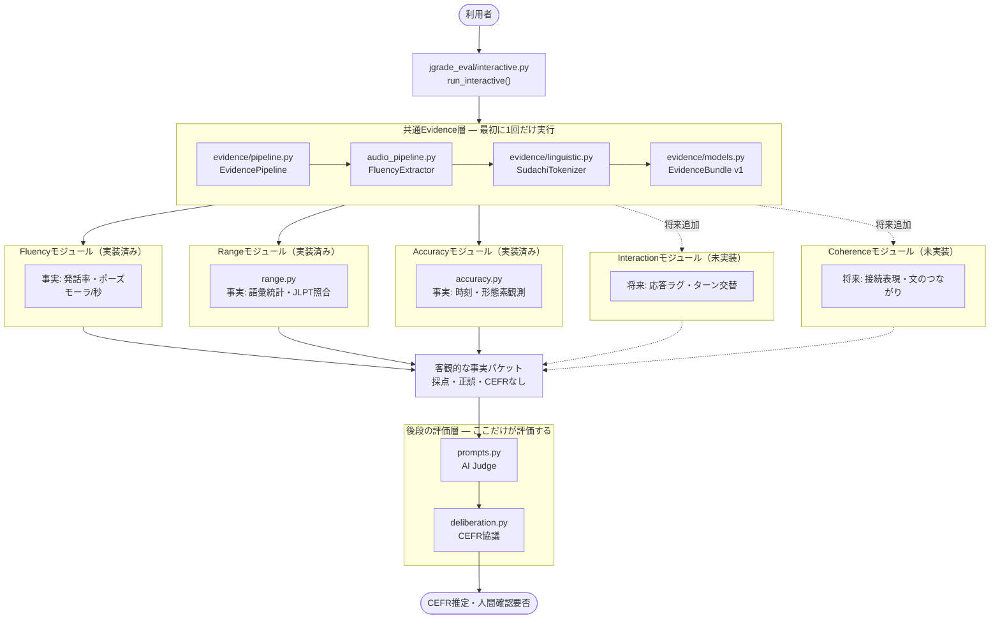

# 現在の構成図 — 共通Evidence層と5要素モジュール

全体を読むための図です。共通Evidence層が最初に1回だけ事実を作り、各モジュールはその同じEvidenceを独立して読みます。採点・正誤・CEFR判定は、最後のAI Judgeと協議層にだけあります。

- 実線: 実装済みのデータフロー
- 点線: 将来のモジュール追加時の接続
- 詳しい呼び出し順は [UMLシーケンス図](accuracy-current-architecture.md) を参照
