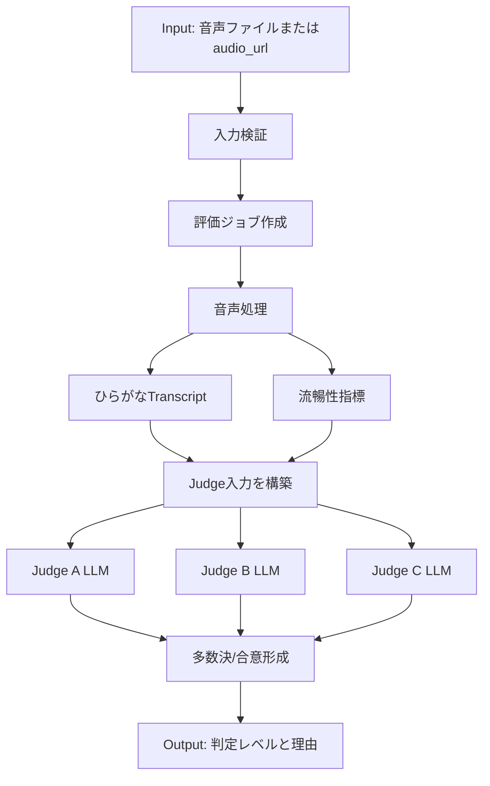

# J-GRADE音声レベル判定System 入出力/API設計資料

## 目的

この資料は、現在までに構築したJ-GRADE音声レベル判定Systemについて、インプット、プロセッシング、アウトプットを説明し、将来ほかのSystemとAPI連携するための境界を定義するものです。

このSystemの目的は、日本語学習者の音声を受け取り、JF日本語教育スタンダード/CEFRの考え方に沿って `A1`、`A2`、`B1`、`B2`、`C1`、`C2` のレベルを推定し、その理由を説明できる形で返すことです。

重要な前提として、音声から抽出したひらがなTranscriptと流暢性指標は、単なる途中結果ではありません。レベル判定の根拠を説明するための客観データです。

## 全体像



## 現在のSystem構成

| 層 | 現在の実装 | 役割 |
| --- | --- | --- |
| 音声処理 | `FluencyExtractor` in `jgrade_eval/audio_pipeline.py` | 音声からひらがなTranscript、発話区間、ポーズ、流暢性指標を抽出する。 |
| プロンプト生成 | `jgrade_eval/prompts.py` | 3 Judgeへ渡す評価指示と出力JSON契約を作る。 |
| LLM Judge | `jgrade_eval/live_judges.py` | 最大3つのLLMに同じ客観データを渡し、独立にCEFR/JFSレベルを推定させる。 |
| 合意形成 | `AutoCefrConsensus` in `jgrade_eval/consensus.py` | Judge A/B/Cの判定を多数決や中央値で集約する。 |
| チューニング/検証 | `jgrade_eval/tuning_runner.py` | 人間教師ラベルや公式JFサンプルと比較し、精度やズレを確認する。 |
| 公式サンプル管理 | `examples/jfs_roleplay_catalog.json` | 公式JFロールプレイ音声の出典、レベル、達成度、評価PDFを管理する。 |

## Input

将来APIでは、音声を2つの形で受け取れるようにする。

1. 音声ファイルを直接アップロードする。
2. ほかのSystemが保存している音声URLを渡す。

直接アップロードは、連携元Systemが音声ファイルをその場で持っている場合に使う。`audio_url` は、連携元SystemがS3などのストレージに音声を置いている場合に使う。

### 入力項目

| 項目 | 必須 | 型 | 説明 |
| --- | --- | --- | --- |
| `audio` または `audio_url` | 必須 | file / string | 判定対象の学習者音声。どちらか一方だけを指定する。 |
| `external_id` | 任意 | string | 連携元System側のID。 |
| `language` | 必須 | string | 初期値は `ja` のみ対応。 |
| `mode` | 任意 | string | `auto_cefr` を基本とする。 |
| `roleplay_task` | 任意 | string | タスク内容。ない場合は `unknown` として扱う。 |
| `jfs_can_do_criteria` | 任意 | string array | JFS/JF Can-do基準。 |
| `speaker_metadata` | 任意 | object | 母語などの属性。個人情報は必要最小限にする。 |
| `judge_providers` | 任意 | string array | Judgeに使うLLMプロバイダ指定。通常はSystem側設定を使う。 |
| `include_objective_data` | 任意 | boolean | ひらがなTranscriptと流暢性指標をレスポンスに含めるか。説明可能性のため基本は `true`。 |

### 直接アップロード例

```http
POST /api/v1/speech-level-evaluations
Content-Type: multipart/form-data
```

```json
{
  "external_id": "candidate-2026-0001",
  "language": "ja",
  "mode": "auto_cefr",
  "roleplay_task": "デパートで服のサイズが合わないため、店員に相談する。",
  "jfs_can_do_criteria": [
    "身近な買い物場面で、簡単な語句や表現を使って必要な相談ができる。"
  ],
  "speaker_metadata": {
    "first_language": "vietnamese"
  },
  "include_objective_data": true
}
```

### 音声URL指定例

```http
POST /api/v1/speech-level-evaluations
Content-Type: application/json
```

```json
{
  "external_id": "candidate-2026-0001",
  "language": "ja",
  "mode": "auto_cefr",
  "audio_url": "https://storage.example.com/evaluations/candidate-2026-0001.mp3",
  "roleplay_task": "unknown",
  "jfs_can_do_criteria": [],
  "include_objective_data": true
}
```

## Processing

### 1. 入力検証

モデル処理を始める前に、API層で以下を検証する。

- `audio` と `audio_url` はどちらか一方だけを受け付ける。
- 初期対応フォーマットは `mp3`、`wav`、`m4a` とする。
- 最大ファイルサイズと最大音声時間を制限する。
- `language` は `ja` のみ受け付ける。
- `judge_providers` は1〜3件、かつ重複なしにする。
- APIキーやLLMプロバイダ認証情報はリクエスト本文では受け取らない。

### 2. 音声処理

現在の `FluencyExtractor` は、音声から以下を作る。

| 出力 | 説明 |
| --- | --- |
| `raw_transcript_hiragana` | 音声から検出した、実際の発話に近いひらがなTranscript。 |
| `raw_transcript_romaji` | 確認用のローマ字表記。 |
| `speech_segments` | 発話区間。 |
| `top_pauses` | 長いポーズ。 |
| `fluency_metrics.audio_duration_sec` | 音声全体の長さ。 |
| `fluency_metrics.speech_ratio_pct` | 音声時間に対する発話時間の割合。 |
| `fluency_metrics.pause_count` | ポーズ数。 |
| `fluency_metrics.max_pause_sec` | 最長ポーズ秒数。 |
| `fluency_metrics.mora_count` | 検出モーラ数。 |
| `fluency_metrics.mora_per_sec` | 1秒あたりのモーラ数。 |
| `fluency_metrics.fluency_grade` | 既存の粗い流暢性グレード。 |

ひらがなTranscriptは、漢字変換、語句補完、自然な日本語への修正をしない。判定は、あくまで音声から出た客観データをベースに行う。

### 3. Judge入力の構築

Judgeに渡す入力は以下を含む。

- タスク情報: `roleplay_task`、`jfs_can_do_criteria`
- 話者情報: `speaker_metadata`
- 客観データ: `raw_transcript_hiragana`、`fluency_metrics`
- 判定指示: `A1`〜`C2` からCEFR/JFSレベルを1つ推定する

Judgeの出力理由には、必ず以下の3種類の根拠を含める。

- `transcript:` ひらがなTranscript上の意味内容、まとまり、タスク達成の根拠
- `metrics:` 発話率、ポーズ、モーラ速度など流暢性指標の根拠
- `boundary:` 上下レベルとの境界判断

### 4. 3 Judgeによるレベル判定

本番相当の判定では、最大3つの独立したLLM Judgeを使う。

| Judge | 入力 | 出力 |
| --- | --- | --- |
| Judge A | 同じTranscriptと流暢性指標 | CEFR/JFSレベル、理由、根拠 |
| Judge B | 同じTranscriptと流暢性指標 | CEFR/JFSレベル、理由、根拠 |
| Judge C | 同じTranscriptと流暢性指標 | CEFR/JFSレベル、理由、根拠 |

Judge出力例:

```json
{
  "judge_id": "A",
  "model_family": "openai",
  "predicted_cefr_level": "A2",
  "task_rating": "○",
  "confidence": 0.74,
  "rationale": "短い文中心だが、店員にサイズの問題と希望を伝えており、身近な買い物場面のやりとりは達成している。",
  "evidence": [
    "transcript: サイズが合わないことと、別のサイズがあるかを尋ねる発話が見える。",
    "metrics: speech_ratio_pct=72.4, mora_per_sec=3.8, max_pause_sec=1.6で、短いやりとりとしては大きな中断が少ない。",
    "boundary: 理由説明や展開は限定的なのでB1には届かないが、単語のみではなく短文で目的を達成しているためA1より上。"
  ],
  "risk_flags": []
}
```

### 5. 多数決/合意形成

現在の `AutoCefrConsensus` は以下のルールで最終レベルを出す。

| Judge結果 | 最終判定 | 人間レビュー |
| --- | --- | --- |
| 3 Judgeで多数派あり | 多数派レベル | 不要 |
| 3 Judgeが全員異なる | 中央値レベル | 必要 |
| 2 Judgeが同じ | そのレベル | 不要 |
| 2 Judgeが異なる | 低い方のレベル | 必要 |
| 1 Judgeのみ成功 | そのJudgeのレベル | 必要 |

APIでは、最終レベルだけでなく、Judge間の不一致と `needs_human_review` を必ず返す。

### 6. チューニング/検証

現在は公式JFロールプレイ音声を、評価エンジンの検証・調整用データとして使える。

| レベル | 公式サンプル数 |
| --- | ---: |
| A2 | 4 |
| B1 | 4 |
| B2 | 3 |
| C1 | 2 |

現時点の公式音声データにはA1とC2がない。特にC2判定は、検証済みC2音声が追加されるまで人間レビュー必須として扱う。

## Output

APIのアウトプットは、まず最終判定を返し、その後に理由・根拠・診断情報を返す。

### 完了レスポンス例

```http
GET /api/v1/speech-level-evaluations/eval_01J2X3
```

```json
{
  "data": {
    "id": "eval_01J2X3",
    "external_id": "candidate-2026-0001",
    "status": "completed",
    "final_cefr_level": "A2",
    "task_rating": "○",
    "confidence": 0.74,
    "needs_human_review": false,
    "summary": "A2相当。身近な買い物場面で、短い文と定型表現を使ってサイズの問題と希望を伝えられている。",
    "reasons": [
      {
        "type": "transcript",
        "text": "サイズが合わないことと、別のサイズを求める内容がひらがなTranscript上に確認できる。"
      },
      {
        "type": "metrics",
        "text": "発話率とモーラ速度は短いやりとりとして十分で、最長ポーズもタスク達成を大きく妨げていない。"
      },
      {
        "type": "boundary",
        "text": "説明の展開や理由付けは限定的なのでB1には届かないが、単語中心のA1よりは上。"
      }
    ],
    "objective_data": {
      "raw_transcript_hiragana": "すみませんこのふくはすきですがさいずがちょっとおおきいです...",
      "fluency_metrics": {
        "audio_duration_sec": 48.02,
        "speech_ratio_pct": 72.4,
        "pause_count": 8,
        "max_pause_sec": 1.6,
        "mora_count": 183,
        "mora_per_sec": 3.81,
        "fluency_grade": "B"
      }
    },
    "consensus": {
      "method": "auto_cefr_consensus",
      "has_strict_majority": true,
      "judge_count": 3
    },
    "judge_results": [
      {
        "judge_id": "A",
        "model_family": "anthropic",
        "predicted_cefr_level": "A2",
        "task_rating": "○",
        "confidence": 0.76,
        "rationale": "身近な買い物場面の目的は短文で達成している。",
        "evidence": [
          "transcript: サイズが合わないことを伝えている。",
          "metrics: 大きな沈黙が少ない。",
          "boundary: 展開が限定的でB1までは届かない。"
        ],
        "risk_flags": []
      }
    ],
    "created_at": "2026-07-02T10:00:00Z",
    "completed_at": "2026-07-02T10:00:42Z"
  }
}
```

## 推奨API設計

現在のローカルMVPは、`POST /api/v1/speech-level-evaluations` の1リクエスト内で音声処理、3 Judge、合意形成を実行し、`201 Created` で完了結果を返す同期APIとして実装している。これはローカル検証とPRレビューで試しやすくするための形である。

起動:

```bash
.venv/bin/python -m uvicorn jgrade_eval.api:app --host 127.0.0.1 --port 8000
```

音声アップロード:

```bash
curl -s -X POST http://127.0.0.1:8000/api/v1/speech-level-evaluations \
  -F "audio=@audio/vietnamese_japanese_1min.mp3" \
  -F "external_id=local-api-smoke" \
  -F "language=ja" \
  -F "judge_mode=mock" \
  -F "roleplay_task=社会的な話題について、自分の考えと理由を述べる。" \
  | python -m json.tool
```

完了した評価は、同じプロセス内のメモリに保持される。

```bash
curl -s http://127.0.0.1:8000/api/v1/speech-level-evaluations/{id} | python -m json.tool
```

音声処理とLLM Judge呼び出しは時間がかかるため、外部Systemとの本格統合時は非同期ジョブ型にする。

### `POST /api/v1/speech-level-evaluations`

評価ジョブを作成する。

成功時:

```http
HTTP/1.1 202 Accepted
Location: /api/v1/speech-level-evaluations/eval_01J2X3
```

```json
{
  "data": {
    "id": "eval_01J2X3",
    "status": "queued",
    "external_id": "candidate-2026-0001",
    "links": {
      "self": "/api/v1/speech-level-evaluations/eval_01J2X3"
    }
  }
}
```

### `GET /api/v1/speech-level-evaluations/{id}`

評価ジョブの状態、または完了結果を取得する。

処理中の例:

```json
{
  "data": {
    "id": "eval_01J2X3",
    "status": "judging",
    "stage": "llm_judges",
    "progress": {
      "objective_data_extracted": true,
      "judge_results_completed": 1,
      "judge_results_expected": 3
    }
  }
}
```

### `GET /api/v1/speech-level-evaluations`

連携元Systemや管理画面から、評価履歴を検索する。

主なクエリ:

- `status`
- `external_id`
- `created_at[after]`
- `created_at[before]`
- `limit`
- `cursor`

### 将来追加: `POST /api/v1/speech-level-evaluations/{id}/teacher-corrections`

人間教師による修正を保存する。

```json
{
  "corrected_cefr_level": "B1",
  "note": "後続質問への対応を考えると、A2ではなくB1相当。"
}
```

この修正は、元の評価結果を上書きせず、チューニング用の補正履歴として保存する。

## ステータス設計

| status | 意味 |
| --- | --- |
| `queued` | リクエスト受付済み。処理待ち。 |
| `extracting_objective_data` | 音声からTranscriptと流暢性指標を抽出中。 |
| `judging` | LLM Judgeが判定中。 |
| `aggregating` | 多数決/合意形成中。 |
| `completed` | 最終判定完了。 |
| `failed` | 処理失敗。 |

`needs_human_review` は、`status` とは別のbooleanとして返す。たとえば、処理は `completed` だがJudgeが割れたため `needs_human_review=true` になる。

## エラー形式

```json
{
  "error": {
    "code": "audio_processing_failed",
    "message": "音声ファイルの客観データ抽出に失敗しました。",
    "details": [
      {
        "field": "audio",
        "code": "unsupported_format",
        "message": "Supported formats are mp3, wav, and m4a."
      }
    ]
  }
}
```

主なHTTPステータス:

| HTTP | 用途 |
| --- | --- |
| `202 Accepted` | 評価ジョブを受け付けた。 |
| `400 Bad Request` | JSONやmultipartの形式が壊れている。 |
| `401 Unauthorized` | 認証なし。 |
| `403 Forbidden` | 権限なし。 |
| `404 Not Found` | 評価IDが存在しない。 |
| `422 Unprocessable Entity` | 音声形式、言語、Judge指定などが不正。 |
| `429 Too Many Requests` | レート制限。 |
| `503 Service Unavailable` | モデルやLLMプロバイダが一時利用不可。 |

## 保存・プライバシー方針

音声には個人情報が含まれる可能性があるため、API化時には以下を設計に入れる。

- 音声ファイルの保存期間を設定できるようにする。
- 必要に応じて、客観データ抽出後に元音声を削除できるようにする。
- ひらがなTranscript、流暢性指標、最終判定、Judge結果、処理ログを分離して保存する。
- `speaker_metadata` は必要最小限にする。
- 連携元Systemごとにデータを分離する。
- 教師修正は監査ログとして残す。

## API化するときの実装方針

API層は薄く保つ。API層の責務は、入力検証、ファイル保存、ジョブ作成、結果取得、エラー整形に限定する。

既存のサービス層は以下のように使う。

| 将来APIの処理 | 既存実装 |
| --- | --- |
| 客観データ抽出 | `FluencyExtractor.extract(audio_path)` |
| 3 Judge実行 | `judge_auto_cefr_with_live_panel_partial(...)` |
| 最終レベル集約 | `AutoCefrConsensus().decide(...)` |
| ベンチマーク/チューニング | `run_tuning_dataset(...)` |

## 初期APIの完了条件

初期APIは、以下を満たせば他Systemとの統合に使える。

1. `mp3`、`wav`、`m4a`を受け取れる。
2. `final_cefr_level`、`summary`、`reasons`、`objective_data`、`judge_results`、`needs_human_review` を返せる。
3. ひらがなTranscriptを漢字変換・補完・自然化せず、音声由来のデータとして保持する。
4. 3つの独立したLLM Judgeを使い、Judge間の不一致を出力できる。
5. 公式JFサンプルデータセットで、完全一致率、隣接一致率、ミスマッチサンプルを出せる。
6. 構造化エラーを返し、APIキーやプロバイダ内部エラーを外部に漏らさない。
7. C2は検証済み音声データが追加されるまで、未検証レベルとして人間レビュー必須にする。
