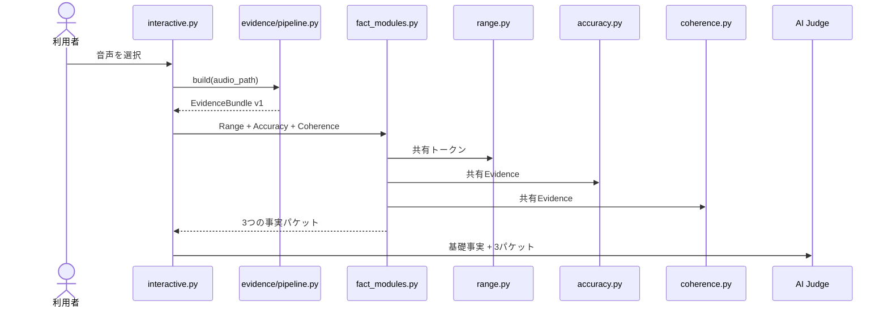

# Terminal Fact-Module Sequence

The terminal selects every implemented fact module, but module collection exists only once in `fact_modules.py`. The three modules consume the same immutable shared evidence and do not call one another.

